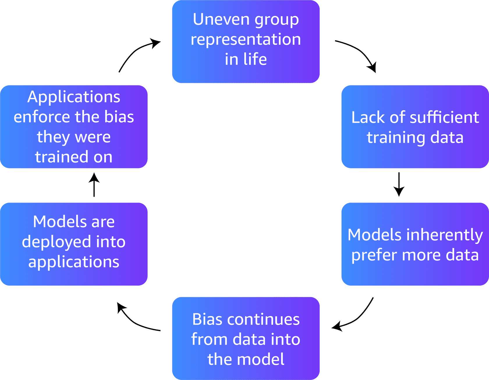
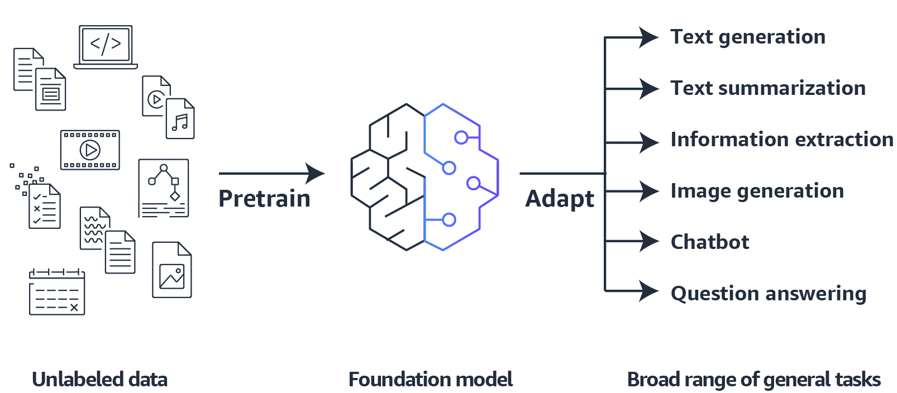

# Prompt Engineering Essentials

## Prompt Engineering

- When interacting with a Foundation Model, a Prompt is the Input Practitioners provide to the Model to generate a Response or Output. Essentially, Prompts act as Instructions guiding the Model on what to perform.
- The Quality and Structure of the Prompt significantly influence the Foundation Model's Performance on specific Tasks. This is where _Prompt Engineering_ plays a crucial Role.
- _Prompt Engineering_ is a critical Field that focused on optimizing the Design, Development, and Interaction with Language Models, especially large Models. Core Aspects of _Prompt Engineering_ include:
  - Enhancing the Capabilities of Language Models.
  - Addressing and mitigating their Limitations.
  - Gaining deeper Insights into how Models function.
- _Prompt Engineering_ provides Strategies and Techniques to push the Boundaries of Language Models' Performance. It aims to:
- **Designing Effective Prompts**: Create Prompts that precisely convey the Task to the Model.
- **Optimizing Interactions**: Refine Prompts to improve Model Performance for specific Tasks.
- **Understanding Model Behavior**: Gain Insights into how Models interpret and respond to Prompts, which can further inform Development and Application of these Technologies.
- **Aligning Model Outputs with Human Values**: Use Reinforcement Learning Techniques, like Reinforcement Learning from Human Feedback (RLHF), to ensure that Model Outputs align with Human Preferences and ethical Standards.

### Difference Between Prompt Engineering and Fine-Tuning

- Fine-tuning modifies the Model’s Weights or Parameters using Training Data to optimize a Cost Function. While effective, Fine-tuning is computationally expensive and time-consuming.
- _Prompt Engineering_, in Contrast, involves crafting Inputs to guide pre-trained Models (such as Large Language Models or Text-to-image Models) to deliver accurate and relevant Responses.
- _Prompt Engineering_, when integrated with RLHF, focuses on optimizing the Interaction between Prompts and Models, using Human Feedback to shape the Model’s Responses in Ways aligned with Human Values and Expectations.

### Benefits of Prompt Engineering

- _Prompt Engineering_ is the fastest and most cost-effective Way to leverage Large Language Models (LLMs). By engaging with an LLM through well-crafted Questions, Statements, or Instructions, Practitioners can fine-tune Outputs to meet specific Needs.
- Effective Prompt Techniques provide Businesses with several Benefits:
  - **Boost a Model's Performance and Safety**: Techniques like RLHF enhance Model Output Quality and ensure Alignment with ethical Standards.
  - **Integrate Domain Knowledge and external Tools**: Augment the Model’s Performance without requiring Fine-tuning by incorporating additional Tools and external Data into Prompts.
- **Harness the full Capabilities of Language Models**: Explore and utilize Models’ wide Range of Functionalities. RLHF refines Model Interactions, enabling better handling of complex or sensitive Prompts.
- **Achieve better Output through better Input**: Higher-quality Prompts lead to more accurate and relevant Outputs. RLHF further enhances this by refining Model Responses based on Human Feedback.

### Elements of a Prompt

- The Form of a Prompt varies depending on the Task Practitioners assign to the Model.
- Examples of Prompt Design may include the following Elements:
  - **Instructions**: Describe the Task or Directive for the Model to perform.
  - **Context**: Supply additional Information that helps the Model generate a more accurate Response.
  - **Input Data**: Provide the Input for which the Practitioner seeks a Response.
  - **Output Indicator**: Define the expected Type or Format of the Output.

### Best Practices for designing effective Prompts

| Recommendation                                   | Description                                                                                                                                                                                                   | Bad Prompt                                               | Good Prompt                                                                                                                                                                |
| ------------------------------------------------ | ------------------------------------------------------------------------------------------------------------------------------------------------------------------------------------------------------------- | -------------------------------------------------------- | -------------------------------------------------------------------------------------------------------------------------------------------------------------------------- |
| Be clear and concise                             | Prompts should be straightforward, avoiding Ambiguity. Clear, natural Language leads to more coherent Responses.                                                                                              | Compute the Sum of the following Sequence: 4, 8, 12, 16. | What is the Sum of these Numbers: 4, 8, 12, 16?                                                                                                                            |
| Include Context if needed                        | Provide relevant Background Information to guide the Model’s Response. The Context may vary depending on the Input or be consistent across multiple Inputs.                                                   | Summarize this Article: [insert Text]                    | Provide a Summary of this Article to be used in a Blog Post: [insert Text]                                                                                                 |
| Use Directives for the appropriate Response Type | Specify the desired Response Type and Format, such as a Summary, Question, or structured Format. Limit Responses if necessary.                                                                                | What is the Capital?                                     | What is the Capital of New York? Provide the Answer in a full Sentence.                                                                                                    |
| Consider the Output in the Prompt                | Specify the expected Output at the End of the Prompt to keep the Model focused on the Task.                                                                                                                   | Calculate the Area of a Circle.                          | Calculate the Area of a Circle with a Radius of 3 Inches (7.5 cm). Round your answer to the nearest Integer.                                                               |
| Start Prompts with an Interrogation              | Phrase Inputs as Questions, starting with who, what, where, when, why, and how.                                                                                                                               | Summarize this Event.                                    | Why did this Event happen? Explain in three Sentences.                                                                                                                     |
| Provide an Example Response                      | Supply an Example of the desired Output Format in the Prompt, enclosed in Brackets, to guide the Model.                                                                                                       | Determine the Sentiment of this Post: [insert Text]      | Determine the Sentiment of the following Post using these Examples: post: "great Pen" => Positive; post: "I hate when my phone Battery dies" => Negative; [insert Text] => |
| Break up complex Tasks                           | For complex Tasks, break them down into Subtasks to avoid confusing the Model. Ask the Model to confirm its Understanding before proceeding with each Step. If needed, prompt the Model to work Step-by-Step. | -                                                        | -                                                                                                                                                                          |
| Experiment and be creative                       | Try different Variations of Prompts to determine which ones yield the best Results.                                                                                                                           | -                                                        | -                                                                                                                                                                          |

### Advanced Prompt Engineering Techniques

- When refining Prompts, several advanced Techniques can be employed to achieve specific Outcomes. These Techniques become even more powerful when combined with RLHF, which helps align Model Outputs with Human Goals and Preferences.

#### Zero-Shot Prompting

- Zero-shot Prompting is a Technique where a Model is asked to complete a Task without providing prior Examples or Context. The Practitioner expects the Model to perform the Task based solely on its internal Understanding. Despite the Lack of prior exposure to the Task, modern LLMs can often perform remarkably well.

##### Tips for Zero-Shot Prompting

- **Model Size**: Larger LLMs are more likely to produce effective Zero-shot Responses due to their broader contextual Understanding.
- **Instruction Tuning & RLHF**: Instruction tuning can improve Zero-shot Learning by helping the Model adapt to a wider variety of Tasks. RLHF can be used to scale Instruction Tuning and align the Model's Responses with Human Values, ensuring that it both understands the Task and meets Expectations.
- **Example Prompt**:

```text
Explain the importance of biodiversity in ecosystems.
```

#### Few-Shot Prompting

- Few-shot Prompting provides Examples of Tasks along with their expected Outputs. These Examples, or "Shots," help the Model better understand the Task's Context and generate more accurate Responses.

##### Tips for Few-Shot Prompting

- **Label Accuracy**: Labels in Few-shot Prompts do not need to be perfectly accurate to improve Performance. Interestingly, random Labels can sometimes outperform using no Labels.
- **Range of Examples**: Providing a diverse Range of Examples improves the Model’s Contextual Understanding.
- **Label Space and Input Distribution**: Ensuring a diverse Label Space and distributing Input Text properly enhances the Model's Ability to generalize.
- **Dynamic Adaptation**: If the Practitioner has many Examples, they should dynamically adjust the Number of Tokens used within the Model's Limits. This can be refined further with RLHF, allowing Human Feedback to fine-tune Prompts based on contextual Understanding.
- **Example Prompt**:

```text
Translate the following sentences into French:
1. The cat is on the roof.
2. The weather is sunny today.
```

#### Chain-of-Thought (CoT) Prompting

- Chain-of-Thought Prompting breaks down complex Tasks into intermediate Reasoning Steps, guiding the Model through a Sequence of logical Operations to reach the correct Conclusion. CoT Prompting can be used in Combination with both Zero-shot and Few-shot Prompting.

##### Tips for Chain-of-Thought Prompting

- **Multi-step Tasks**: CoT Prompting works particularly well for Tasks that involve multiple Reasoning Steps or require a Breakdown of the Thought Process.
- **“Think Step by Step”**: A simple Phrase like "Think step by step" can invoke CoT Reasoning from the Model, encouraging it to break the Task into smaller Steps.
- **RLHF**: RLHF can be integrated to ensure the Model’s Reasoning aligns with Human Expectations at each Step, enhancing Coherence and Accuracy.
- **Example Prompt**:

```text
To solve the math problem 24 divided by 6, think step by step.
```

#### Self-Consistency

- Self-Consistency builds on CoT by prompting the Model to sample multiple Reasoning Paths before aggregating the final Answer. Rather than following a single Path, the Model explores various Approaches and selects the most consistent Answer.

##### Tip for Self-Consistency Prompting

- **Path Exploration**: Encourage the Model to explore different Ways of solving a Task. Self-Consistency prompts the Model to look at multiple Reasoning Paths and evaluate them based on their Consistency.
- **RLHF**: RLHF can be applied to refine the Selection and Weighting of Reasoning Paths based on Human Feedback, leading to more accurate and reliable Results.
- **Example Prompt**:

```text
Solve the math problem 12 times 15 using different methods and find the most consistent answer.
```

#### Tree of Thoughts (ToT)

- Tree of Thoughts (ToT) is an Extension of CoT Prompting. While CoT typically follows a sequential Path of Reasoning, ToT allows the Model to explore multiple Branching Paths simultaneously, leading to a more comprehensive Solution.

##### Tip for Tree of Thoughts

- **Non-linear Tasks**: ToT is particularly useful for Tasks requiring non-linear Decision-making, such as Planning, Strategy, or Problem-solving that requires multiple potential Solutions.
- **Tree-Branching Technique**: The Model can self-evaluate Choices and explore multiple Paths at each Decision Point, improving Performance on Tasks that require complex Reasoning and Planning.
- **Example Prompt**:

```text
Outline a business plan for a new tech startup considering multiple strategies and choose the best approach.
```

#### Retrieval Augmented Generation (RAG)

- Retrieval Augmented Generation (RAG) is a Technique that injects external domain-relevant Data into the Prompt’s Context without altering the Model's Parameters. RAG retrieves Documents from external Databases, making it especially useful for Tasks requiring up-to-date Information.

##### Tip for Retrieval Augmented Generation

- **Cost Efficiency**: RAG is more efficient than Fine-tuning because it does not change the Model’s Weights. This makes it a cost-effective Solution for Tasks that require frequent Updates.
- **Keeping Data Current**: RAG works well when the external Data is regularly updated. It's crucial to ensure that external Documents, Databases, or APIs are properly maintained to avoid outdated Information.
- **Example Prompt**:

```text
Using the latest research papers on climate change, explain the impact of global warming on polar ice caps.
```

#### Automatic Reasoning and Tool-Use (ART)

- Automatic Reasoning and Tool-Use (ART) is a Prompting Technique that combines multi-step Reasoning with the Use of external Tools, such as Search Engines or Code Generators. This Technique is highly effective for complex, unseen Tasks, often outperforming traditional Few-shot and automatic CoT Prompting.

##### Tip for Automatic Reasoning and Tool-Use

- **Tool Integration**: ART allows the Model to integrate external Tools and Databases, making it highly efficient for Tasks requiring both Reasoning and access to external Information.
- **Performance on unseen Tasks**: ART significantly improves Performance on Tasks that the Model has not seen before, and it can match the Effectiveness of handcrafted CoT Prompts.
- **Example Prompt**:

```text
Using a database of economic indicators and code generation tools, analyze the economic impact of a new tax policy.
```

#### ReAct Prompting

- ReAct Prompting enables Models to perform both Reasoning and Actions simultaneously. By accessing external Data Sources, such as Databases or APIs, the Model can enhance Accuracy and reduce Hallucination in Outputs. This Approach is especially useful for Tasks requiring both critical Thinking and Access to real-world Information.

##### Tip for ReAct Prompting

- **Reasoning + Action**: ReAct allows the Model to generate Reasoning Traces and execute specific Actions based on external Data. This reduces fact Hallucination and ensures that the Model’s Reasoning is grounded in real-world Information.
- **Combining Tools**: ReAct excels when used with external Sources like Wikipedia or SQL Databases, making it ideal for fact-heavy Tasks that require both Reasoning and Fact Retrieval.
- **Example Prompt**:

```text
Research the latest advancements in AI, summarize key points, and generate an action plan for integrating these advancements into our company.
```

## Generative AI and Foundation Models

- Generative AI is a Type of Artificial Intelligence that can create new Content and Ideas, including Conversations, Stories, Images, Videos, and Music.
- Like all other AI, generative AI is powered by Machine Learning (ML) Models
- Generative AI is powered by very large Models, commonly called Foundation Models. Foundation Models are pre-trained on a vast Corpus of Data, usually through self-supervised Learning.

### Concepts for LLM Parameters

- When interacting with LLMs through an API or directly, the Practitioners can configure Prompt Parameters to get customized Results.
- Generally, the Practitioners should only adjust one Parameter at a Time, and Results can vary depending on the LLM.
- The following parameters can be used to modify the output from the LLMs. Not all parameters are available with all LLMs.

#### Determinism Parameters

- **Temperature**: Controls Randomness. Lower Values focus on probable Tokens, and higher Values add Randomness and Diversity. Use lower Values for factual Responses and higher Values for creative Responses.
- **Top_p**: Adjusts Determinism with "nucleus sampling". Lower Values give exact Answers, while higher Values give diverse Responses. This Value controls the Diversity of the Model's Responses.
- **Top_k**: The Number of the highest-probability Vocabulary Tokens to keep for Top-k-Filtering. Similar to the _Top_p_ Parameter, _Top_k_ defines the Cutoff where the Model no longer selects the Words.

#### Token Count

- **MinTokens**: The minimum Number of Tokens to generate for each Response.
- **MaxTokenCount**: The maximum Number of Tokens to generate before Stopping.

#### Stop Sequences

- **StopSequences**: A List of Strings that will cause the Model to stop generating.

#### Number of Results

- **numResults**: The Number of Responses to generate for a given Prompt.

#### Penalties

- **FrequencyPenalty**: A Penalty applied to Tokens that are frequently generated.
- **PresencePenalty**: A Penalty applied to Tokens that are already present in the Prompt.
- **CountPenalty**: A Penalty applied to Tokens based on their Frequency in the generated Responses.

### Adversarial Prompts

- Adversarial Prompts are Prompts that are designed to purposefully mislead Models and break the Integrity and Safety of AI Applications.
- Types of adversarial Prompts are Prompt Injection and Prompt Leaking.

#### Prompt Injection

- Prompt Injection is a Technique for influencing the Outputs of Models by using specific Instructions in the Prompt.
- For Example a Hacker might provide Prompts to a Text Generation Model containing harmful, unethical, or biased Content to generate similar Text. This can be used to create Fake News, Propaganda, or other malicious Content at Scale.
- Non-Malicious Uses: Prompt Injection can also be used for legitimate Purposes, such as overriding the Responses from Models, customizing Translations to keep Product Names consistent, and more.
- Preventing Prompt Injection: To avoid Prompt Injection, add Guardrails to the Prompt. Guardrails can include specific Instructions that prevent the Model from generating harmful or unethical Content.
- Example Prompt with Guardrails:

```
Please translate the following text from English to French, ensuring that any product names remain unchanged and avoid including any harmful or inappropriate language in the translation.
```

#### Prompt Leaking

- Prompt Leaking refers to the Risk that a Model might unintentionally disclose sensitive or private Information through the Prompts or Examples it generates.
- For Example if a Model is trained on private Customer Data to generate Product Recommendations, it might leak details about Customers' Purchases or Browsing History in the Recommendations it generates for new Customers. This could violate Customers' Privacy and Trust in the Model.
- To avoid Prompt Leaking, Models often have built-in Mechanisms to prevent Prompt Leaking. It is always recommended to test thoroughly to ensure that specific Use Cases do not pose a Risk of exposing Private Information.
  - Some Best Practices to avoid Prompt Leaking are:
  - Regularly audit the Model's Outputs for unintended Disclosures.
  - Implement strict Data Privacy Protocols during Training.
  - Use anonymized or aggregated Data when possible.

### Mitigating Bias in Models

- The Data that Models are trained on might contain Biases. If Data contains Biases, the Model is likely to reproduce them. Ultimately, the Model might end up with Outputs that are biased or unfair.
- Bias can appear in Prompt Engineering in the following two Ways:
  - Biased Prompts: If the Prompts are built on Assumptions, the Prompts themselves may be biased. For Example, a Query that assumes all Software Developers are Men can cause the Model to produce biased Results towards Men.
  - Biased Outputs from Neutral Prompts: Even if the Prompts are not written with Bias, Models can sometimes produce biased Results due to possible Biases in the Training Data. For Example, even when given a gender-neutral Prompt, the Model may provide Responses that assume Software Developers are Male if it has been trained on Data that primarily features Male Software Developers.
- If there are not have sufficient Data when Training a Model, that Lack of Data can create Bias. Insufficient Data leads to low Confidence in the Model, and most Toxicity Filters and Ranking Algorithms inherently prefer confidence in Models. This leads to presumed Exclusion for many groups, thus perpetuating Bias.

<p align="center">
  
</P>

- The following three Techniques can help mitigate Bias in Foundation Models:

##### Update the Prompt

- Providing explicit Guidance in Prompts can reduce inadvertent Performance at Scale. There are a few Methods for mitigating Bias in a Model's Output through Prompt updates:
- **Text-to-Image Disambiguation (TIED) Framework**: This Method focuses on avoiding Ambiguity in Prompts by asking Clarifying Questions to understand the User's Intent and avoid Ambiguous, and possibly biased, Answers.
- **Text-to-Image Ambiguity Benchmark (TAB)**: This Benchmark provides a Schema in the Prompt to ask Clarifying Questions, offering various Options and Questions for the Model to ask.
- **Clarify Using Few-Shot Learning**: Have the Model generate Clarifying Questions using Few-shot Learning. By giving the Model Context and Examples of Questions that help clarify the Context, disambiguated Prompts can mitigate Bias in the Model's Output.
- Example Prompt:

```
Describe the role of a software developer without assuming gender.
```

#### Enhance the Dataset

- Enhancing the Training Dataset can help mitigate Bias by introducing more diverse Examples and different Types of Pronouns. For LLMs trained on Text, it is possible to use counterfactual Data Augmentation to artificially expand the Model's Training Set by using modified Data from the existing Dataset.
- For LLMs trained on Images, it is also possible to use counterfactual Data Augmentation. The process to augment Images to introduce more Diversity consists of the following three Steps:
  1. Detect: Use Image Classification to detect People, Objects, and Backgrounds in the Dataset. Compute Summary Statistics to detect Dataset Imbalances.
  2. Segment: Use Segmentation to generate Pixel Maps of Objects to replace.
  3. Augment: Use Image-to-Image Techniques to update the Images and equalize Distributions.

#### Use Training Techniques

- There are Techniques at the Training Level that can help mitigate Bias, such as using equalized Odds and Fairness Criteria as Model Objectives.
  - **Equalized Odds to Measure Fairness**: Equalized Odds aim to equalize the Error a Model makes when predicting categorical Outcomes for different Groups. This involves matching True Positive Rate and False Positive Rate for different Groups.
  - **Using Fairness Criteria as Model Objectives**: Model Training is usually optimized for Performance as the singular Objective. Combined Objectives could include other Metrics such as Fairness, Energy Efficiency, and Inference Time.

## Understanding FM Functionality

- The Size and general-purpose Nature of Foundation Models make them different from traditional ML Models. Foundation Models use Deep Neural Networks to emulate Human Brain Functionality and handle complex Tasks. Foundation Models can be adapted for a broad Range of general Tasks, such as Text Generation, Text Summarization, Information Extraction, Image Generation, Chatbot, and Question Answering. Foundation Models can also serve as the Starting Point for developing more specialized Models.

<p align="center">
  
</P>

### Self-Supervised Learning

- Although traditional ML Models rely on supervised, semi-supervised, or unsupervised Learning Patterns
- Foundation Models are typically pre-trained through self-supervised Learning.
- With self-supervised Learning, labeled Examples are not required. Self-supervised Learning makes Use of the Structure within the Data to autogenerate Labels.

### Training, Fine-Tuning, and Prompt Engineering

- Foundation Models go through various Stages of Training to achieve the best Results:
  1. **Pre-training**: During the Training Stage, Foundation Models use self-supervised Learning or Reinforcement Learning from Human Feedback (RLHF) to capture Data from vast Datasets. The Foundation Model's Algorithm can learn the Meaning, Context, and Relationship of the Words in the Datasets. In addition, RLHF can be used during Pre-training to better align the Model with Human Preferences. In this Approach, Humans provide Feedback on the Model Outcomes, and that Information is used by the Model to change its Behavior.
  2. **Fine-tuning**: Though Foundation Models are pre-trained through self-supervised Learning and have the inherent Capability of understanding Information, Fine-tuning the Foundation Model Base Model can improve Performance. Fine-tuning is a supervised Learning Process that involves taking a pre-trained Model and adding specific, smaller Datasets. Adding these narrower Datasets modifies the Weights of the Data to better align with the Task. There are two ways to fine-tune a Model:
     1. **Instruction Fine-Tuning**: Uses Examples of how the Model should respond to a specific Instruction. _Prompt tuning_ is a Type of Instruction Fine-tuning.
     2. **RLHF**: Provides Human Feedback Data, resulting in a Model that is better aligned with Human Preferences.
  3. **Prompt Engineering**: Prompts act as Instructions for Foundation Models. They are similar to Fine-tuning, but the Practitioner does not need to provide labeled Sample Data as they would to fine-tune a Model. Practitioners use various Prompt Techniques to achieve better Performance. _Prompt Engineering_ is a more efficient Way to tune (large Language Model) LLM Responses, as opposed to Fine-tuning, which requires labeled Data and Training Infrastructure.

### Categories of Foundation Models

- Foundation Models can be categorized into multiple Types. Two of the most frequently used Models are _Text-to-Text Models_ and _Text-to-Image Models_.

#### Text-to-Text Models

- Text-to-text Models are LLMs pre-trained to process vast Quantities of textual Data and Human Language.

##### Natural Language Processing (NLP)

- NLP is a Machine Learning Technology that gives Machines the Ability to interpret and manipulate Human Language. NLP does this by analyzing the Data, Intent, or Sentiment in the Message and responding to Human Communication.
- Typically, NLP Implementation begins by gathering and preparing unstructured Text or Speech Data from different Sources and processing the Data.
- It uses Techniques such as Tokenization, Stemming, Lemmatization, Stop Word Removal, Part-of-Speech Tagging, Named Entity Recognition, Speech Recognition, Sentiment Analysis, and so on. However, modern LLMs do not require using these intermediate Steps.

##### Recurrent Neural Network (RNN)

- RNNs use a Memory Mechanism to store and apply Data from previous Inputs. This Mechanism makes RNNs effective for sequential Data and Tasks, such as Natural Language Processing, Speech Recognition, or Machine Translation.
- RNNs are slow and complex to train, and they ca not be used for Training Parallelization.

##### Transformer

- A Transformer is a Deep-Learning Architecture that has an Encoder Component that converts the Input Text into Embeddings. It also has a Decoder Component that consumes the Embeddings to emit some Output Text.
- Unlike RNNs, Transformers are extremely parallelizable, which means instead of processing Text Words one at a Time during the Learning Cycle, Transformers process Input all at the same Time. It takes Transformers significantly less Time to train, but they require more Computing Power to speed Training.
- The Transformer Architecture was the Key to the Development of LLMs. These Days, most LLMs only contain a Decoder Component.

#### Text-to-Image Models

- Text-to-Image Models take natural Language Input and produce a high-quality Image that matches the Input Text Description.

##### Diffusion Architecture

- Diffusion is a deep-learning Architecture System that learns through a two-step Process.
  1. The first Step is called Forward Diffusion. Using Forward Diffusion, the System gradually introduces a small Amount of Noise to an Input Image until only the Noise is left over. There is a U-Net Model that tracks and predicts the Noise Level.
  2. In the subsequent Reverse Diffusion Step, the noisy Image is gradually de-noised until a new Image is generated. During the Training Process, the Model gets the Feed of Text, which is added to the Image Vector.

## Large Language Models (LLMs)

- LLMs are a Subset of Foundation Models and are trained on vast Text Corpus across many natural Language Tasks.
- They can understand, learn, and generate Text that is nearly indistinguishable from Text produced by Humans.
- LLMs can also engage in interactive Conversations, answer Questions, summarize Dialogues and Documents, and provide Recommendations.
- Because of their sheer Size and AI Acceleration, LLMs can process vast Amounts of textual Data.

### Understanding LLM Functionality

- Most LLMs are based on a Transformer Model. They receive Input, encode the Data, and then decode the Data to produce an Output Prediction.

#### Neural Network Layers

- Transformer Models are effective for Natural Language Processing because they use Neural Networks to understand the Nuances of Human Language.
- Neural Networks are Computing Systems modeled after the Human Brain.
- There are multiple Layers of Neural Networks in a single LLM that work together to process Input and generate Output. The following are three Key Categories of Neural Network Layers:
  - **Embedding Layer**: The Embedding Layer converts Input Text to Vector Representations called Embeddings. This Layer can capture complex Relationships between the Embeddings, so the Model can understand the Context of the Input Text.
  - **Feedforward Layer**: The Feedforward Layer consists of several connected Layers that transform the Embeddings into more weighted Versions of themselves. Essentially, this Layer continues to contextualize the Language and helps the Model better understand the Input Text's Intent.
  - **Attention Mechanism**: With the Attention Mechanism, the Model can focus on the most relevant Parts of the Input Text. This Mechanism, a central Part of the Transformer Model, helps the Model achieve the most accurate Output Results.

### Training a Foundation Model

- Training a Foundation Model involves a Series of Steps designed to prepare the Model for a wide Range of Tasks. These Steps are essential to developing robust, general-purpose Models that can be fine-tuned or prompted effectively for specific Applications.

1. Text Preprocessing

- **Tokenization**: The Process begins with breaking down the Text into Tokens, which can be Words, Sub-words, or Characters, depending on the Model Architecture. This is a critical Step, as it defines how the Model will interpret and generate Text.
- **Cleaning the Text**: The Text is cleaned by removing unnecessary Elements such as Stop-words, Punctuation, and other irrelevant Characters. Depending on the Model, this Step might also involve Lowercasing or Lemmatization, though more advanced Models may not require extensive Preprocessing.

2. Word Embedding Creation

- **Embedding Method Selection**: Choose between frequency-based Embeddings (like TF-IDF) and prediction-based Embeddings (such as Word2Vec or GloVe). These Embeddings translate Text into numerical Vectors that capture semantic Relationships between Words.
- **Context Window Identification**: In prediction-based Embeddings, a Context Window is used to determine the Relationships between Target and Context Words, which the Model uses to understand Word Meanings and Relationships.

3. Model Training

- **Training Objective**: The Model is trained to minimize Prediction Error, typically using methods like Stochastic Gradient Descent (SGD) and Backpropagation. The Goal is to adjust the Model's Parameters so that it accurately predicts the next Word or Phrase in a Sequence.
- **High Dimensionality**: Embeddings typically involve hundreds of Dimensions to capture complex Relationships within the Data. The Dimensionality is chosen based on the Corpus Size and the Complexity of the Tasks the Model will perform.

4. Advanced Techniques with Transformers

- **Contextual-Based Embeddings**: Transformer Models, such as BERT and GPT, use contextual Embeddings, where the Representation of a Word changes based on its surrounding Context. This allows the Model to capture more nuanced Meanings and Relationships between Words.
- **Pre-training and Fine-Tuning**: Transformers are often pre-trained on large Corpora before being fine-tuned on specific Tasks. Fine-Tuning can involve traditional Methods or Reinforcement Learning from Human Feedback (RLHF) to align the Model more closely with Human Values.

5. Application to NLP Tasks

- **Text Classification**: The trained Model is applied to various NLP Tasks, such as Spam Detection, sentiment Analysis, and Topic Categorization, using the Embeddings as the basis for understanding the Input Text.
- **Named Entity Recognition (NER)**: The Model is used to identify and classify Entities in Text, with contextual Embeddings providing a more accurate Understanding of the Text.
- **Word Similarity and Analogy Tasks**: The Model’s Ability to recognize and generate semantically similar Words and Phrases is tested and refined.
- **Question Answering Systems**: The Model is fine-tuned for Tasks that require Understanding and Responding to user Queries, with RLHF helping to ensure the Answers are accurate and appropriate.

6. Model Evaluation and Fine-Tuning

- **Evaluation Metrics**: The Model's Performance is evaluated using Metrics such as Accuracy, Precision, Recall, and F1-score. For specific Tasks like Machine Translation, Metrics like BLEU Score are used.
- **Fine-Tuning**: Based on the Evaluation, the Model is fine-tuned to improve its Performance on specific Tasks or Datasets. Fine-Tuning can involve supervised Learning with labeled Data or using Techniques like RLHF to adjust the Model’s Behavior based on Human Feedback.
